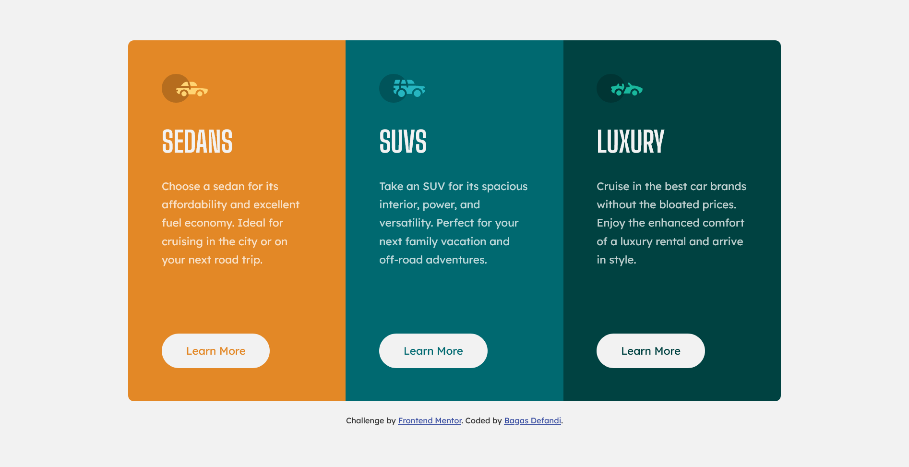

# Frontend Mentor - 3-column preview card component solution

This is a solution to the [3-column preview card component challenge on Frontend Mentor](https://www.frontendmentor.io/challenges/3column-preview-card-component-pH92eAR2-). Frontend Mentor challenges help you improve your coding skills by building realistic projects.

## Table of contents

- [Overview](#overview)
  - [The challenge](#the-challenge)
  - [Screenshot](#screenshot)
  - [Links](#links)
- [My process](#my-process)
  - [Built with](#built-with)
  - [What I learned](#what-i-learned)
  - [Useful resources](#useful-resources)
- [Author](#author)

## Overview

### The challenge

Users should be able to:

- View the optimal layout depending on their device's screen size
- See hover states for interactive elements

### Screenshot




### Links

- Solution URL: [Github](https://github.com/bagas-defandi/Frontend-Mentor/tree/master/3-column-preview-card-component)
- Live Site URL: [Live Site](https://bagas-defandi-frontend-mentor.netlify.app/3-column-preview-card-component/)

## My process

### Built with

- Semantic HTML5 markup
- CSS custom properties
- Flexbox
- CSS Grid
- Mobile-first workflow

### What I learned

use `flexbox` to make layout responsive and make sure each column have the same width, with code like this:

```css
@media screen and (min-width: 62.5em) {
  .container {
    display: flex;
  }

  /* even columns */
  .container > * {
    flex-basis: 100%;
  }
}
```

### Useful resources

- [Kevin Powell responsive course](https://courses.kevinpowell.co/conquering-responsive-layouts) - This helped me to learn mobile first workflow, using relative units, and flexbox.
- [Andy Bell's reset](https://piccalil.li/blog/a-modern-css-reset/) - Modern CSS Reset.
- [Andy Bell's Flow class](https://piccalil.li/quick-tip/flow-utility/) - This is an easy way to add some space.
- [Kevin Powell](https://www.youtube.com/watch?v=vQAvjof1oe4) - Flexbox design patterns in project

## Author

- Frontend Mentor - [@bagas-defandi](https://www.frontendmentor.io/profile/bagas-defandi)
