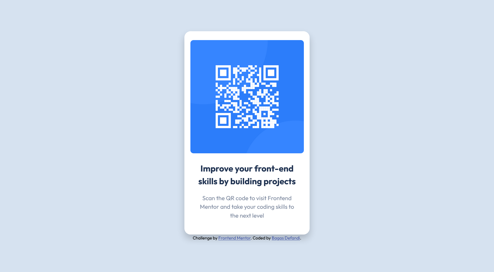

# Frontend Mentor - QR code component solution

This is a solution to the [QR code component challenge on Frontend Mentor](https://www.frontendmentor.io/challenges/qr-code-component-iux_sIO_H). Frontend Mentor challenges help you improve your coding skills by building realistic projects.

## Table of contents

- [Overview](#overview)
  - [Screenshot](#screenshot)
  - [Links](#links)
- [My process](#my-process)
  - [Built with](#built-with)
  - [Useful resources](#useful-resources)
- [Author](#author)

## Overview

### Screenshot

### Links

- Solution URL: [Github](https://github.com/bagas-defandi/Frontend-Mentor/tree/master/QR-code-component)
- Live Site URL: [Live Site](https://bagas-defandi-frontend-mentor.netlify.app/qr-code-component/)

## My process

### Built with

- Semantic HTML5 markup
- CSS custom properties
- CSS Grid
- Mobile-first workflow

### Useful resources

- [Kevin Powell responsive course](https://courses.kevinpowell.co/conquering-responsive-layouts) - This helped me to learn mobile first workflow, using relative units, and flexbox.
- [Andy Bell's reset](https://piccalil.li/blog/a-modern-css-reset/) - Modern CSS Reset.
- [Andy Bell's Flow class](https://piccalil.li/quick-tip/flow-utility/) - This is an easy way to add some space.

## Author

- Frontend Mentor - [@bagas-defandi](https://www.frontendmentor.io/profile/bagas-defandi)
