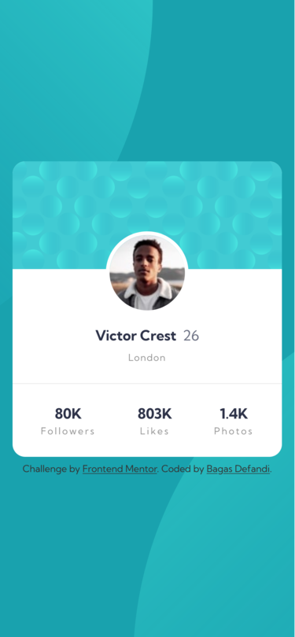
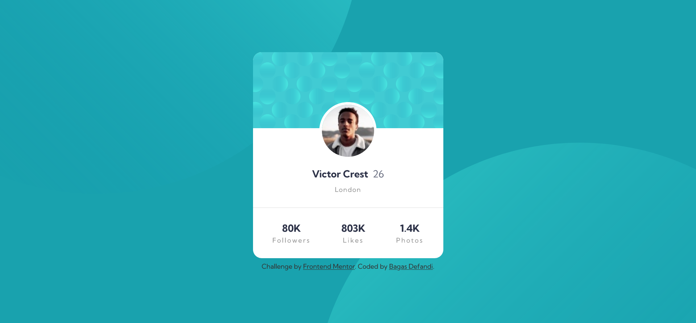

# Frontend Mentor - Profile card component solution

This is a solution to the [Profile card component challenge on Frontend Mentor](https://www.frontendmentor.io/challenges/profile-card-component-cfArpWshJ). Frontend Mentor challenges help you improve your coding skills by building realistic projects.

## Table of contents

- [Overview](#overview)
  - [The challenge](#the-challenge)
  - [Screenshot](#screenshot)
  - [Links](#links)
- [My process](#my-process)
  - [Built with](#built-with)
  - [What I learned](#what-i-learned)
  - [Continued development](#continued-development)
  - [Useful resources](#useful-resources)
- [Author](#author)

## Overview

### The challenge

- Build out the project to the designs provided

### Screenshot




### Links

- Solution URL: [Github](https://github.com/bagas-defandi/Frontend-Mentor/tree/master/profile-card-component)
- Live Site URL: [Live Site](https://bagas-defandi-frontend-mentor.netlify.app/profile-card-component/)

## My process

### Built with

- Semantic HTML5 markup
- CSS custom properties
- Flexbox
- CSS Grid
- Mobile-first workflow

### What I learned

I struggle to make the background image responsive,
i see this [Youtube](https://www.youtube.com/watch?v=NZpG9EBKYWc) videos and find out we can use view port unit in background position like this:

```css
body {
  background-position: bottom 40vh right 48vw, top 44vh left 45vw;
}
```

### Continued development

Use more semantic tag like `<figure>` instead of `<div>` <br>
use `aria-hidden="true"` on decorative image

### Useful resources

- [Kevin Powell responsive course](https://courses.kevinpowell.co/conquering-responsive-layouts) - This helped me to learn mobile first workflow, using relative units, and flexbox.
- [Andy Bell's reset](https://piccalil.li/blog/a-modern-css-reset/) - Modern CSS Reset.

## Author

- Frontend Mentor - [@bagas-defandi](https://www.frontendmentor.io/profile/bagas-defandi)
