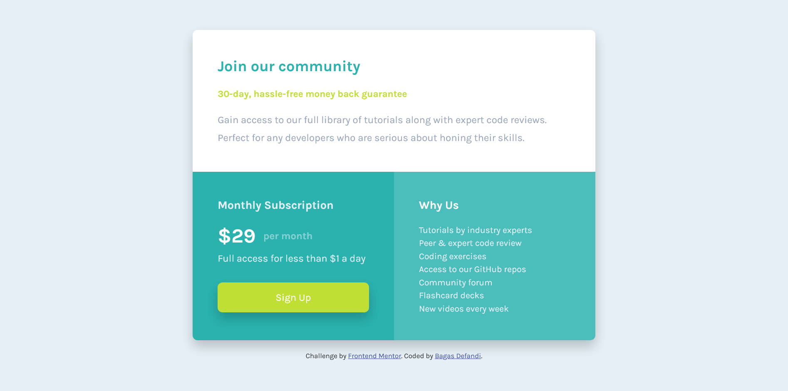

# Frontend Mentor - Single price grid component solution

This is a solution to the [Single price grid component challenge on Frontend Mentor](https://www.frontendmentor.io/challenges/single-price-grid-component-5ce41129d0ff452fec5abbbc). Frontend Mentor challenges help you improve your coding skills by building realistic projects.

## Table of contents

- [Overview](#overview)
  - [The challenge](#the-challenge)
  - [Screenshot](#screenshot)
  - [Links](#links)
- [My process](#my-process)
  - [Built with](#built-with)
  - [What I learned](#what-i-learned)
  - [Useful resources](#useful-resources)
- [Author](#author)

## Overview

### The challenge

Users should be able to:

- View the optimal layout for the component depending on their device's screen size
- See a hover state on desktop for the Sign Up call-to-action

### Screenshot




### Links

- Solution URL: [Github](https://github.com/bagas-defandi/Frontend-Mentor/tree/master/single-price-grid-component)
- Live Site URL: [Live Site](https://bagas-defandi-frontend-mentor.netlify.app/single-price-grid-component)

## My process

### Built with

- Semantic HTML5 markup
- CSS custom properties
- Flexbox
- CSS Grid
- Mobile-first workflow

### What I learned

Use `grid-templete-areas` to make layout responsive:

```css
.container {
  grid-template-areas:
    "join"
    "subscription"
    "reason";
}

@media screen and (min-width: 33em) {
  .container {
    grid-template-areas:
      "join join"
      "subscription reason";
  }
}
```

### Useful resources

- [Kevin Powell responsive course](https://courses.kevinpowell.co/conquering-responsive-layouts) - This helped me to learn mobile first workflow, using relative units, and flexbox.
- [Andy Bell's reset](https://piccalil.li/blog/a-modern-css-reset/) - Modern CSS Reset.
- [Andy Bell's Flow class](https://piccalil.li/quick-tip/flow-utility/) - This is an easy way to add some space
- [Kevin Powell](https://www.youtube.com/watch?v=rg7Fvvl3taU&t=1s) - Learn grid the easy way.

## Author

- Frontend Mentor - [@bagas-defandi](https://www.frontendmentor.io/profile/bagas-defandi)
